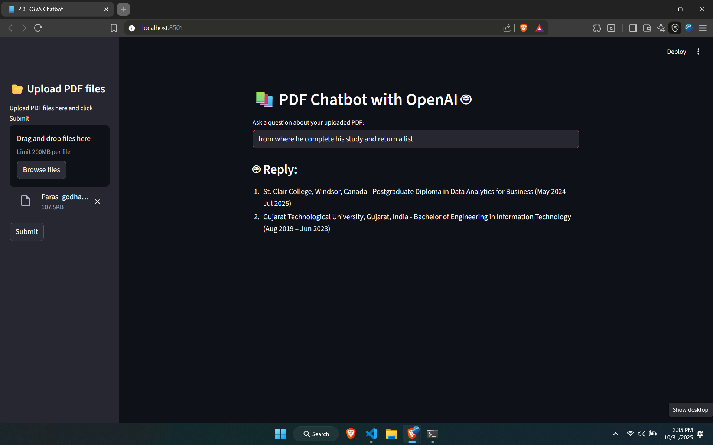

## 📝 Overview
**PDF Chat Bot** is a Streamlit-based web app that enables users to have interactive conversations with a chatbot trained on the contents of uploaded PDF documents. Users can upload multiple PDFs, extract the text, and chat in real time based on the extracted content.

## 🎯 How It Works

The app follows these steps to respond to user queries:  
PDF Upload: Users upload one or more PDF files.  
Text Extraction: The app extracts raw text from each PDF.  
Chunking: The text is split into smaller, manageable sections.  
Embedding Generation: These chunks are converted into vector embeddings using OpenAI embeddings.  
Semantic Search: When a question is asked, the app finds the most relevant chunks using similarity search with FAISS.  
Response Creation: A response is generated using the selected text chunks and an OpenAI chat model (e.g., gpt-3.5-turbo or gpt-4).  

## 🌟 Dependencies  

Streamlit – For building the web interface  
openai – Provides the OpenAI API for generating text and embeddings  
python-dotenv – Loads environment variables (e.g., API keys) from a .env file  
langchain – Framework for managing text chunking, retrieval, and LLM chains  
langchain-community – For community vector stores like FAISS  
langchain-openai – Integration between LangChain and OpenAI APIs  
langchain-text-splitters – For dividing text into smaller overlapping chunks  
faiss-cpu – For performing fast similarity searches using vector embeddings  
PyPDF2 – For PDF reading and text extraction  

## ▶️ Installation Steps  

Install the dependencies:  
   pip install -r requirements.txt  
 
## 🖼️ Screenshot  

Here’s a preview of the application in action:

---

